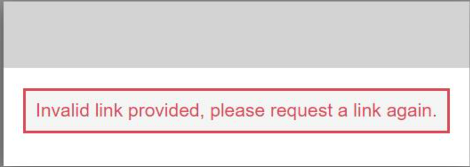
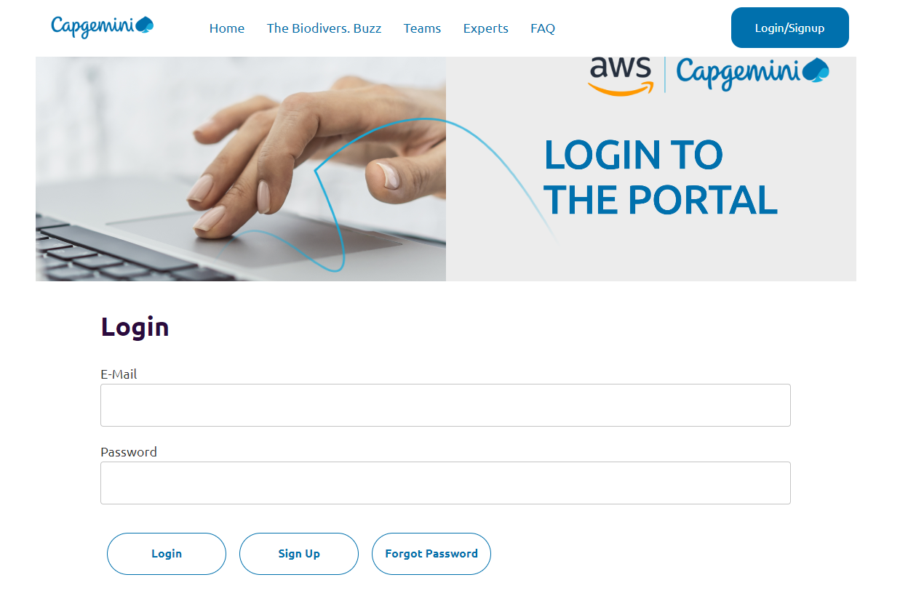
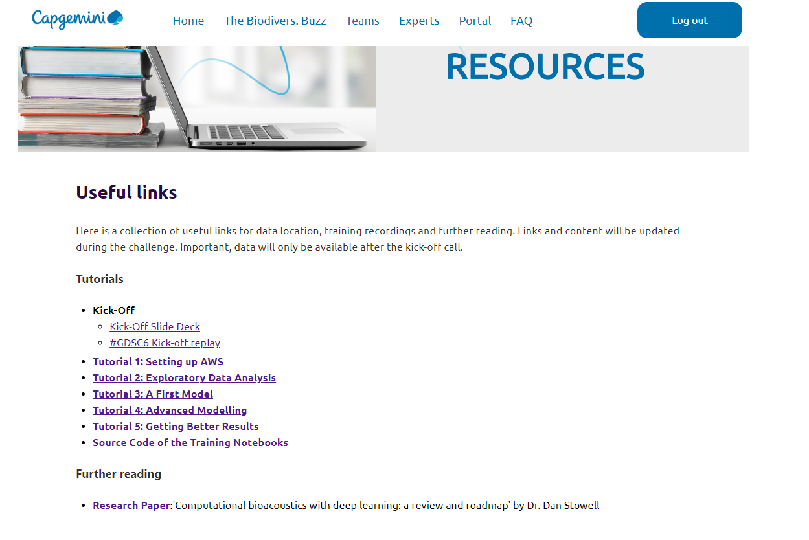
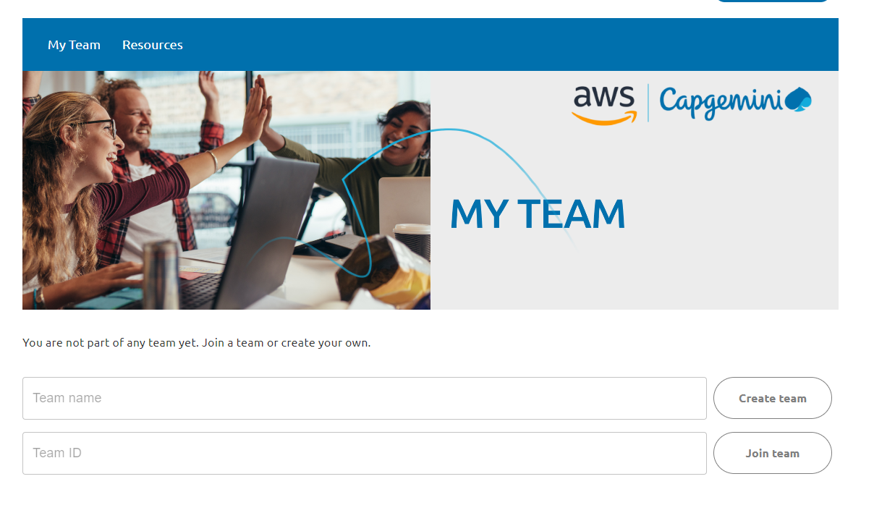
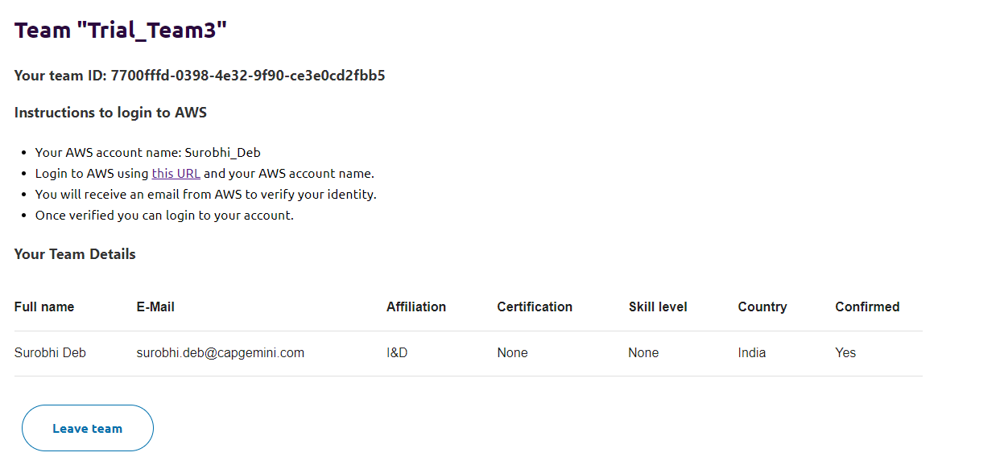
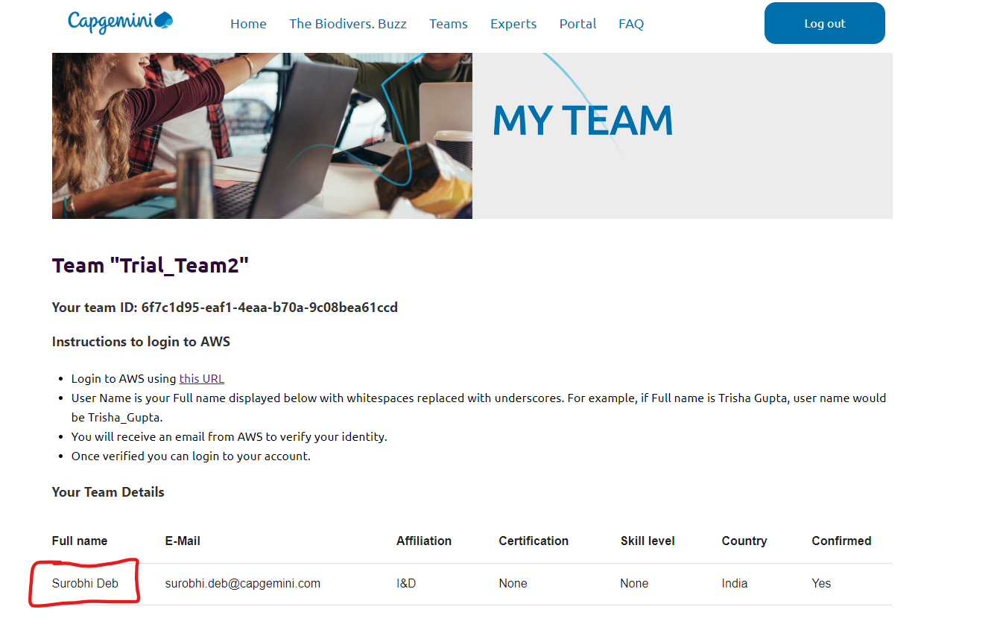
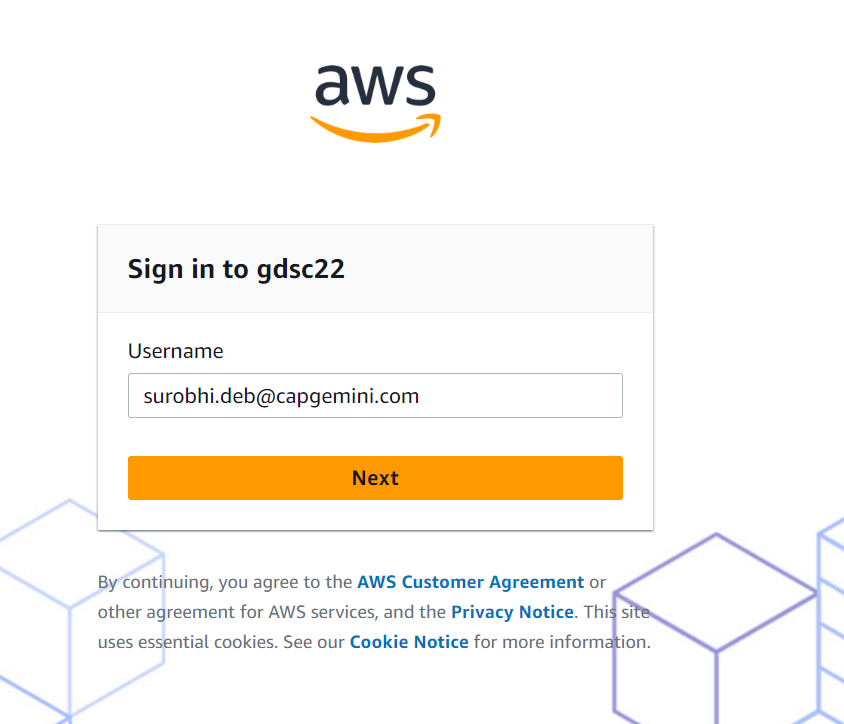
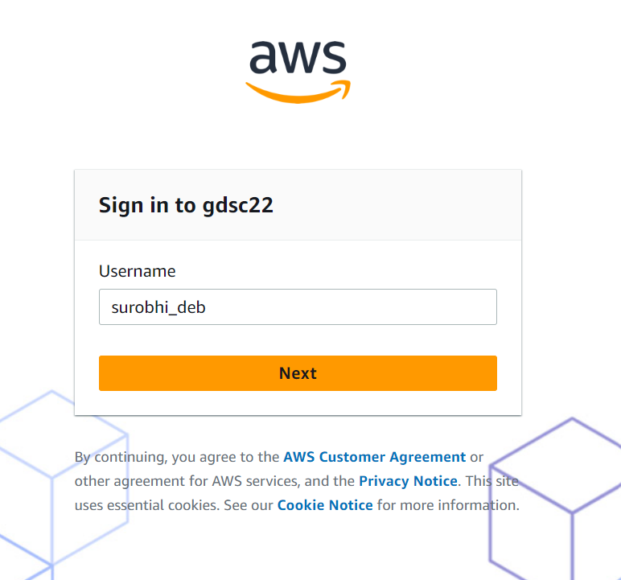
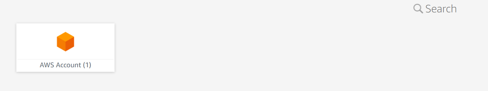
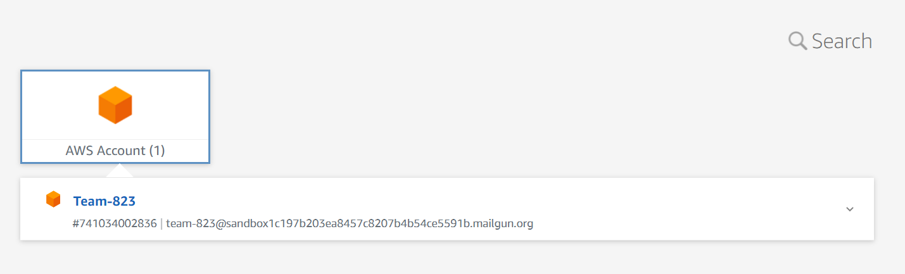

## Tutorial 0 : Step by step process for setting up your account for #GDSC6 challenge

Here are the steps that you would need to follow to set up your account for the Challenge :

Signing Up and Logging to the Website:
 
1. Navigate to the GDSC Portal's Sign-up page - https://gdsc.ce.capgemini.com/app/signup/. Enter all the required details and password in the given format. Please be sure to read and accept the applicable T&Cs.  
2. Once you Sign-up, you will receive an e-mail like the one shown below from gdsc.ce@capgemini.com.  
3. Please click on the Verfication link provided in the e-mail. You will receive an error such as this. But do not worry, you can now login to the website using your e-mail ID and password.  
4. To login to the Website, navigate to the login page - https://gdsc.ce.capgemini.com/app/login/ and enter your credentials.  
5. Once you login you will have access to the Resources - https://gdsc.ce.capgemini.com/app/portal/resources/. The page has link to all the information and Tutorials that you will be needing for the challenge.  

Forming/joining a Team: 
 
1. You may also join the Teams channel (https://teams.microsoft.com/l/team/19%3a4017a2e9af4942e7aa157d6ec9d751b4%40thread.skype/conversations?groupId=7d77d672-dff1-4c9f-ac55-3c837c1bebf9&tenantId=76a2ae5a-9f00-4f6b-95ed-5d33d77c4d61) for active dicussion on all Topics related to the channel. There is a channel for team formation ('Looking for Team') where you can find other members for you to team up with.
2. Every participant needs to register individually and then form a Team with other participants. To form a Team navigate to - https://gdsc.ce.capgemini.com/app/portal/.  
3. If you want to create a new Team, enter the Team name and click on Create Team button. Once your team is selected, you will be seeing a screen like this. 
4. For other members to join this team, please use the Team ID for the Team that you wanted to join, and send the request to join that team. Existing members of the team can view their Team ID on their screens as shown in the pic above and share it with the interested members.
5. Existing members of the team can approve/decline requests from new members. The size of the team can be anywhere between 1-4 members. For join requests beyond this number, there will be an error that will be flashed saying the team is full.

Setting up your AWS accounts: 
 
1. Once you are part of a team, you can login to your AWS accounts using the below credentials. Please note that no automatic e-mails will be sent out and the steps below need to be carried out manually.
2.    URL       : https://gdsc22.awsapps.com/start#/
      User Name : Use your full name as it is displayed in our portal on https://gdsc.ce.capgemini.com/app/portal/ in the 'My Team Page' and replace whitespace with underscores ("_"). Please mind upper- and lowercase in the name._ Your full name will be as marked in red in the pic below.  
3. Once you click on the AWS URL , relace the e-mail ID as username with the username that was suggested in the above step. Change this      to this   
4. Once you do this, you'll receive an email from no-reply@login.awsapps.com with the verification code and then you can set your password. The verification e-mail will look something like this. You need to create a new password.  
5. Once your password is set, you can log in to your account afterwards. You will see a screen like this.  
6. Once you are logged in click on 'AWS Account' and then to the AWS account created for your Team.  
7. For future logins, you can directly click on  https://gdsc22.awsapps.com/start#/ 
8. If you have completed the above steps, you are now ready for the first tutorial in the learning path of the challenge. Here is the link to Tutorial 1 where you will learn further about seting up your AWS accounts. Link - https://app.frame.io/reviews/9702037a-c4d6-4397-87c8-61db0223561b/4ba24fcf-9397-4c6e-935d-fc5a6a56d529?version=71264242-8424-43ec-992e-b04171d8d20e
